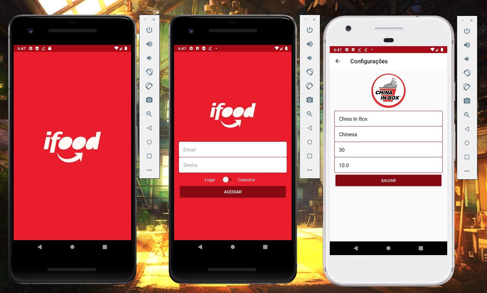
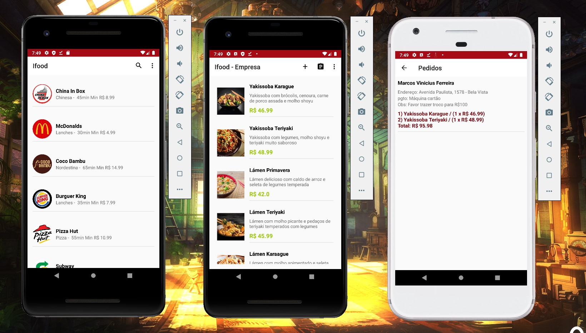

# Ifood Clone

A basic Ifood Clone project, integrated with Firebase Auth, Realtime Database and Storage.

### Developers: 
* [Marcos Vinicius Ferreira](https://github.com/marcosnaofazisso) 

## Goals and Rules:
The main goals of Ifood Clone project on Android development was to study how to replicate the functionality of listing restaurants, show their menu to a user that could create an order and update all data to user interface. 

All data were saved on Firebase Database, updating in real time for both visualizations! This include the ability to register restaurant infos (photo, name, taxes and delivery time), new plates for the menu (photo, price, description) and save it in the main activty for the company, as well as saving these data for the user interface.

The images were saved in Firebase Storage and the library used was Picasso.

# Demo

https://user-images.githubusercontent.com/79977399/215585977-15a10eb1-6ac0-460a-973c-42584549f424.mp4

White Emulator: User
Black Emulator: Company (Restaurant)

User: Images of some of the functionalities like listing all restaurants, checking and selecting plates and creating an order. 
Company: Listing all registered plates, registering a new option, checking orders and accepting a new order.

# Tutorial
Recommended build tools and SDK versions:

Android Studio IDE: 3.5
Android 8.0 / 9.0
Compile 26
Min SDK 15
Max Android SDK Build-Tools 28 (API 9)

    implementation fileTree(dir: 'libs', include: ['*.jar'])
    implementation 'androidx.appcompat:appcompat:1.0.0'
    //implementation 'androidx.constraintlayout:constraintlayout:1.1.3'
    implementation "androidx.constraintlayout:constraintlayout:2.0.0-beta4"
    implementation 'androidx.recyclerview:recyclerview:1.2.1'

    testImplementation 'junit:junit:4.12'
    androidTestImplementation 'androidx.test.ext:junit:1.1.1'
    androidTestImplementation 'androidx.test.espresso:espresso-core:3.1.0'

    //Firebase dependencies
    implementation 'com.google.firebase:firebase-database:11.6.2'
    implementation 'com.google.firebase:firebase-auth:11.6.2'
    implementation 'com.google.firebase:firebase-core:11.6.2'
    implementation 'com.google.firebase:firebase-storage:11.6.2'

    //Picasso dependencies
    implementation 'com.squareup.picasso:picasso:2.71828'

    //MaterialSeachView
    implementation 'com.miguelcatalan:materialsearchview:1.4.0'

    //CircleImageView
    implementation 'de.hdodenhof:circleimageview:3.1.0'

    //Picasso
    implementation 'com.squareup.picasso:picasso:2.71828'

    //Spots Dialog
    implementation 'com.github.d-max:spots-dialog:1.1@aar'

## Thank you!

